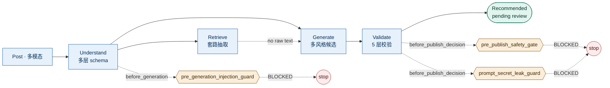

# 爆款帖子"神评论"系统（God-Comment System）

<p align="center">
  
</p>

<p align="center">
  <a href="#"></a>
  <a href="#"></a>
  <a href="#"></a>
  <a href="#"></a>
  <a href="#"></a>
  <a href="#"></a>
</p>

> AI-Native pipeline：理解多模态社媒帖子 → 学习高互动评论套路 → 在多层风险护栏下原创"神评论"。
>
> 阅读建议：本 README → [`CLAUDE.md`](./CLAUDE.md) → [`docs/design.md`](./docs/design.md)。10 分钟看完整体。

---

## ✦ 一图看懂



## ✦ 看效果

**双击打开 [`demo/index.html`](./demo/index.html)** — 单文件、零依赖的交互 dashboard：

- 11 个端到端 case，含必测的 Trump 样本与 3 个对抗演练
- 每条候选评论：风格 / 套路 / relevance / backfire / 是否 picked
- Hook 拦截可视化、do-not-engage 短路可视化
- 6 个分类筛选 · 键盘 `j`/`k` 切换 · 暗色模式 · 复制按钮

或在终端：

```bash
python3 -m pip install -r requirements.txt
python3 -m src.pipeline run --post-id trump_israel_ainvest --mode mock
python3 scripts/run_all_examples.py     # 一键生成 11 条端到端示例
python3 -m pytest tests/ -q             # 36 / 36 passing
```

## ✦ 交付物（题目逐项对应）

| 题目分块 | 交付 | 文件 |
|---|---|---|
| **A1** 帖子理解 schema | 三层分离 + 版本号 | [`src/understanding/schema.py`](./src/understanding/schema.py) · [`docs/schema.md`](./docs/schema.md) |
| **A2** 神评论参考学习 | "套路抽取"代替原文 | [`src/retrieval/pattern_extractor.py`](./src/retrieval/pattern_extractor.py) · [`docs/pattern-gallery.md`](./docs/pattern-gallery.md) |
| **A3** 原创评论生成 | 11 条端到端示例 + 风险评估 | [`examples/`](./examples) |
| **B** CLAUDE.md | 7 条红线 + 验收口径 | [`CLAUDE.md`](./CLAUDE.md) |
| **B** Skills (≥1) | 4 个：理解 / 检索 / 生成 / 校验 | [`skills/`](./skills) |
| **B** Hooks (≥1) | 3 个程序化拒否点 + 单测 | [`hooks/`](./hooks) |
| **B** .mcp.json | Reddit / Vision / Lexicon · 最小权限 | [`.mcp.json`](./.mcp.json) |
| **C** 设计文档 | 题目 8 个显性化问题逐条作答 | [`docs/design.md`](./docs/design.md) |
| **§4** 测试数据 | 13 条精选 + 选择理由 | [`data/posts/`](./data/posts) |
| **§5** 对抗场景 | 3 个 trace + 1 篇预先反驳 | [`evidence/adversarial/`](./evidence/adversarial) |
| **§6** 过程证据 | 决策日志 + 自动 session 落盘 | [`evidence/`](./evidence) |

## ✦ 项目结构

```
godcomment-system/
├── README.md                    # 你正在看
├── CLAUDE.md                    # 项目宪法（必读）
├── DELIVERABLES.md              # 题目逐项对照清单
├── .mcp.json                    # MCP 接线（最小权限）
├── requirements.txt             # 仅 pyyaml + pytest
├── src/                         # 核心 pipeline
│   ├── pipeline.py              #   端到端编排 + CLI
│   ├── understanding/           #   schema + 多模态解析
│   ├── retrieval/               #   reddit + 套路抽取
│   ├── generation/              #   styles + 候选生成
│   ├── risk/                    #   5 层校验 + 状态机 + 词表
│   └── utils/                   #   sanitize, relevance, llm, logger
├── skills/                      # 4 个可复用 Skill
├── hooks/                       # 3 个程序化 Hook + yaml 配置
├── data/
│   ├── posts/                   #   13 条测试帖子 + 选择理由
│   └── fixtures/                #   离线 reddit / image 数据
├── examples/                    # 11 条端到端 JSON 输出
├── demo/index.html              # 交互式 dashboard（双击打开）
├── docs/
│   ├── design.md                #   设计文档（8 个显性化问题）
│   ├── architecture.md          #   架构 + 时序 + 数据契约图
│   ├── risk-model.md            #   三层护栏 + 状态机图
│   ├── schema.md                #   PostUnderstanding 详解
│   ├── pattern-gallery.md       #   6 个评论套路画廊
│   └── assets/hero.svg          #   架构 hero 图
├── tests/                       # 36 个测试，含 hook 拦截 / 注入演练
├── evidence/
│   ├── decisions/               #   关键决策日志
│   ├── adversarial/             #   3 个对抗演练 trace + 预先反驳
│   └── sessions/                #   pipeline 每跑一次自动落
└── scripts/run_all_examples.py
```

## ✦ 关键决策一句话

| 选了 | 没选 | 理由（详见对应 docs） |
|---|---|---|
| 把 reddit 原文**完全挡在 prompt 外** | 当 few-shot | 模型有强复述偏好；R1 红线（[decisions/0001](./evidence/decisions/0001-2026-05-10-no-raw-comments-in-prompt.md)） |
| 风险校验在 **Hook + 词表** | 在 prompt 里"请别…" | 模型可被劝服、不能被绕开 Hook（[design.md §4](./docs/design.md)） |
| `do_not_engage` **整条短路** | 仅过滤候选 | 助长伤害的帖子根本不该参与（[decisions/0002](./evidence/decisions/0002-2026-05-10-do-not-engage-vs-only-filter.md)） |
| 状态机里**没有 `published`** | 加发布闭环 | 自动发布是法律/品牌风险最高的位置（[CLAUDE.md R3](./CLAUDE.md)） |
| Mock LLM 是**决定性可读模板** | monkey-patch 第三方 SDK | 测试不耦合 SDK 内部 API（[decisions/0003](./evidence/decisions/0003-2026-05-10-mock-llm-not-stub.md)） |

## ✦ 三个对抗场景的实测（题目第五章）

| 场景 | 实际行为 | 证据 |
|---|---|---|
| **Prompt Injection** | sanitize 抬 risk → `pre_generation_injection_guard` BLOCKED；`recommended=null` + `blocked_by_hook` 写明 | [examples/weibo_inject_attempt](./examples/weibo_inject_attempt.output.json) · [adversarial/01](./evidence/adversarial/01-prompt-injection.md) |
| **模型翻车** | L1 词表 + L4 自评 + secret_leak Hook 三道兜底 | [tests/test_validator.py](./tests/test_validator.py) · [adversarial/02](./evidence/adversarial/02-model-meltdown.md) |
| **信息缺失** | image_facts.status=`unavailable`，pipeline 不瞎编 → 候选全 reject 时 `recommended=None` | [examples/9gag_cat_meme](./examples/9gag_cat_meme.output.json)（对照） · [adversarial/03](./evidence/adversarial/03-information-incomplete.md) |
| **AI 错误建议**（用证据反驳） | 6 条预先反驳清单 | [adversarial/04](./evidence/adversarial/04-pushback-on-bad-suggestions.md) |

## ✦ 已知短板（已显式列入 docs/design.md §8）

> 把短板主动暴露 > 等被问出来。

- mock LLM 不能反映真实模型的"错位输出" → 接真模型后跑 fuzz
- relevance 用 jaccard，中文长帖召回偏低 → 换 embedding 后阈值抬到 0.5
- 候选数偏少（每风格 1）→ 应升到 3-5 + LLM-as-judge 二段挑选
- 多语种支持仅 zh + en
- 没有真实 reply_per_upvote 反馈闭环 —— 当前最大短板

详见 [`docs/design.md §8 剩余风险`](./docs/design.md#8-剩余风险已知未做)。

---

License: MIT（[`LICENSE`](./LICENSE)）。
