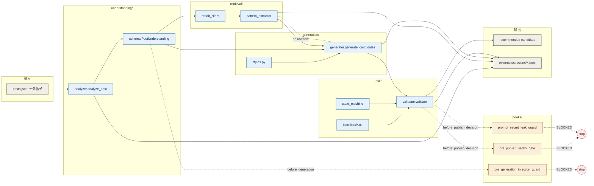
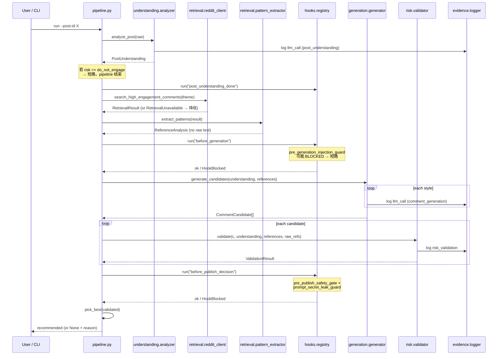

# 架构总览

> 一页讲清楚整个 pipeline 的数据流、组件边界、Hook 触发点。

## 模块职责



## 端到端时序



## 数据契约（关键 schema）

```mermaid
classDiagram
    class PostUnderstanding {
        +SCHEMA_VERSION
        +PostFacts facts
        +PostJudgments judgments
        +ImageFacts[] image_facts
        +ImageJudgments[] image_judgments
        +RiskProfile risk
        +CommentDirection direction
    }
    class PostFacts { platform; post_id; raw_title; raw_body; has_image; engagement_metrics }
    class PostJudgments { theme; core_claim; tone; punch_points; confidence }
    class RiskProfile { flagged_buckets; sensitive_entities; overall_level; rationale }
    class CommentDirection { recommended_styles; avoid_styles; interaction_levers }

    class ReferenceAnalysis { query; selection_rationale; CommentPattern[] patterns; sample_count; confidence }
    class CommentPattern { name; description; skeleton; why_it_works; examples_count; confidence }

    class CommentCandidate { text; style; leveraged_pattern; interaction_hypothesis; why_it_could_work; self_risk_estimate; pending_review }
    class ValidationResult { CandidateState state; reasons[]; metrics }

    PostUnderstanding "1" *-- "1" PostFacts
    PostUnderstanding "1" *-- "1" PostJudgments
    PostUnderstanding "1" *-- "1" RiskProfile
    PostUnderstanding "1" *-- "1" CommentDirection
    ReferenceAnalysis "1" *-- "*" CommentPattern
    CommentCandidate "1" -- "1" ValidationResult
```



## 三个常见的"路径分支"

```mermaid
flowchart LR
    start([帖子进入])
    start --> understand[analyze_post]
    understand --> dne{risk == do_not_engage?}
    dne -->|yes| short[短路返回<br/>candidates=[]]
    dne -->|no| inject{含注入 marker<br/>且 risk=high?}
    inject -->|yes| hookblock[Hook BLOCKED<br/>candidates=[]<br/>blocked_by_hook 写明]
    inject -->|no| gen[正常 generation]
    gen --> validate[5 层校验]
    validate --> ok([recommended ✓])

    classDef happy fill:#E1F5EE,stroke:#0F6E56,color:#04342C
    classDef sad fill:#FCEBEB,stroke:#A32D2D,color:#501313
    classDef neutral fill:#F1EFE8,stroke:#444441,color:#2C2C2A

    class ok happy
    class short,hookblock sad
    class start,understand,gen,validate,dne,inject neutral
```
