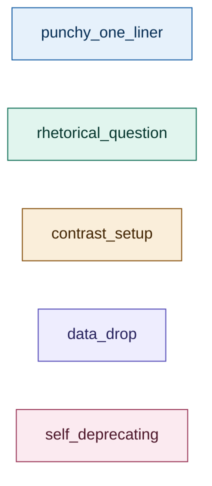
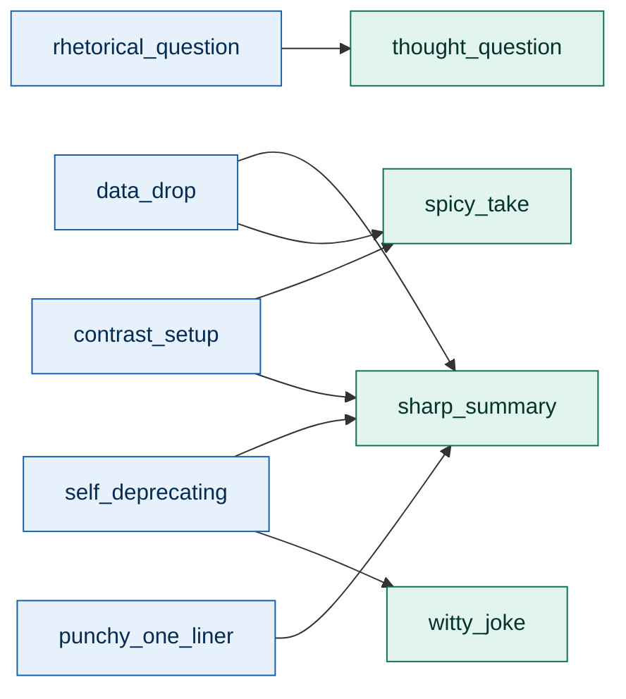
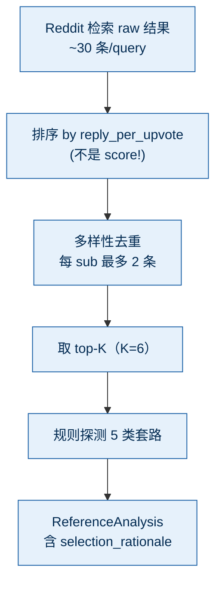

# 神评论"套路"画廊

> 这一页解释 `src/retrieval/pattern_extractor.py` 学到了什么、套路从哪来、怎么用。
> **没有展示任何 Reddit 原文** —— 这是 R1 红线（详见 [`CLAUDE.md`](../CLAUDE.md) §1）。

## 套路总览

## 6 个套路

### 1. punchy_one_liner（极简一句话）

| | |
|---|---|
| **检测信号** | 长度 ≤ 60 字符 + reply_per_upvote 高 |
| **句式骨架** | `<short, punchy summary>` |
| **为什么有效** | 代言群众情绪；门槛低；转发欲望高 |
| **风险** | 容易被误读为吐槽 → 风险 medium 时谨慎用 |
| **本仓库示例（原创）** | 一句话：Trump 是表象，Israel 是骨架。 |

### 2. rhetorical_question（反向提问）

| | |
|---|---|
| **检测信号** | 含 `?` / `？` |
| **句式骨架** | `<setup statement> ... <question that flips the framing>` |
| **为什么有效** | 提问比断言更安全，且引导回复（reply 链） |
| **风险** | 对纯娱乐贴显得"用力过猛" |
| **本仓库示例（原创）** | 认真问一下：如果把 Trump 换成 Israel，你的判断会变吗？ |

### 3. contrast_setup（先承认再反转）

| | |
|---|---|
| **检测信号** | 含 `but / 然而 / 其实` |
| **句式骨架** | `<concede X> ... <but flip to Y>` |
| **为什么有效** | 反转触发认知失调，激发回复欲 |
| **风险** | 反转过激 → 容易被理解为引战 |
| **本仓库示例（原创）** | 这个空间感是真的好，但 30 岁还在挑墙漆颜色这事，比户型更值得复盘。 |

### 4. data_drop（丢一个数字）

| | |
|---|---|
| **检测信号** | 含 ≥ 2 位数字 |
| **句式骨架** | `<concrete number> + <implication>` |
| **为什么有效** | 数字让评论不像情绪发泄、更像"内行" |
| **风险** | 编数字 → 翻车成本大；必须是真的 |
| **本仓库示例（原创）** | 11 年的资历进 2025 年的市场，匹配的是 2014 年的 senior 价 —— 这才是市场变了的真意思。 |

### 5. self_deprecating（自嘲共情）

| | |
|---|---|
| **检测信号** | 含 `I am / 我也 / same here` |
| **句式骨架** | `<self-include statement> ... <relatable pain>` |
| **为什么有效** | 把读者拉进来，比单纯的判断更有粘性 |
| **风险** | 用在严肃灾难帖会显得轻佻 |
| **本仓库示例（原创）** | 我也"加把劲"过，劲是加上了，命没省下来。 |

### 6. style-as-fallback（无明显信号时）

当上面 5 个都没有命中时，我们退化到**纯风格 guideline**：
- `sharp_summary` → 一句话总结读者心声
- `thought_question` → 一句中性追问

这条不是"套路"，是"安全网"。`pipeline.py` 在 `references.confidence == "empty"` 时走它。

## 套路 → 风格映射

> 映射规则在 `src/generation/generator.py::_pick_pattern_for_style`。
> generator 按 `style → preferred_pattern` 选最匹配的一个套路喂给 LLM 当**灵感**（不是范文）。

## 我们如何"筛"高互动评论

**为什么不用 score 排序**：score 偏向"暖文"和"鼓掌型"评论 —— 那种评论 reply 少（无人需要回复"+1"）。我们要的是激发互动密度，所以用 `reply_per_upvote`。

详细实现在 [`src/retrieval/pattern_extractor.py`](../src/retrieval/pattern_extractor.py)。

## 接入真 Reddit MCP 时的注意

- `src/retrieval/reddit_client.py` 已留好 `_real_search()` 占位
- 真实接入必须遵守 `.mcp.json` 里的 `REDDIT_RATE_LIMIT_PER_MIN=30`
- 失败显式抛 `RetrievalUnavailable`，**不要**返回空列表伪装成"没找到" —— 那会让 pattern_extractor 误判 confidence
