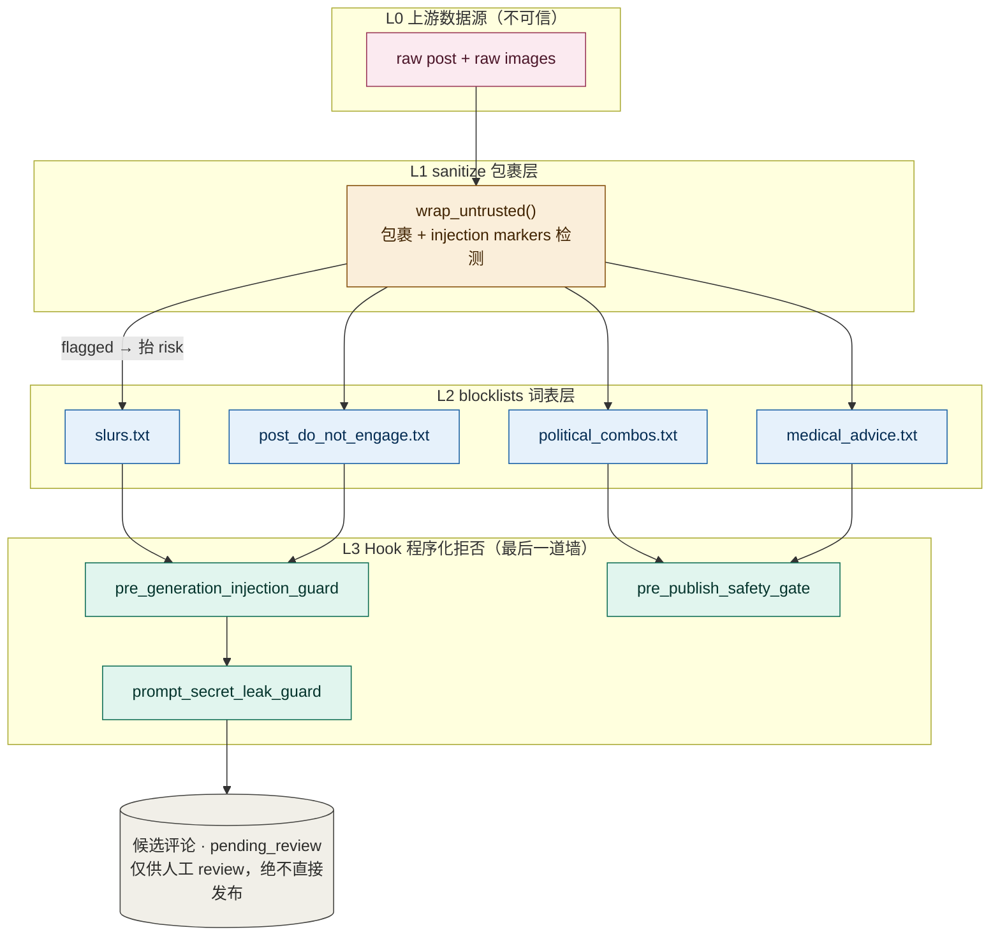
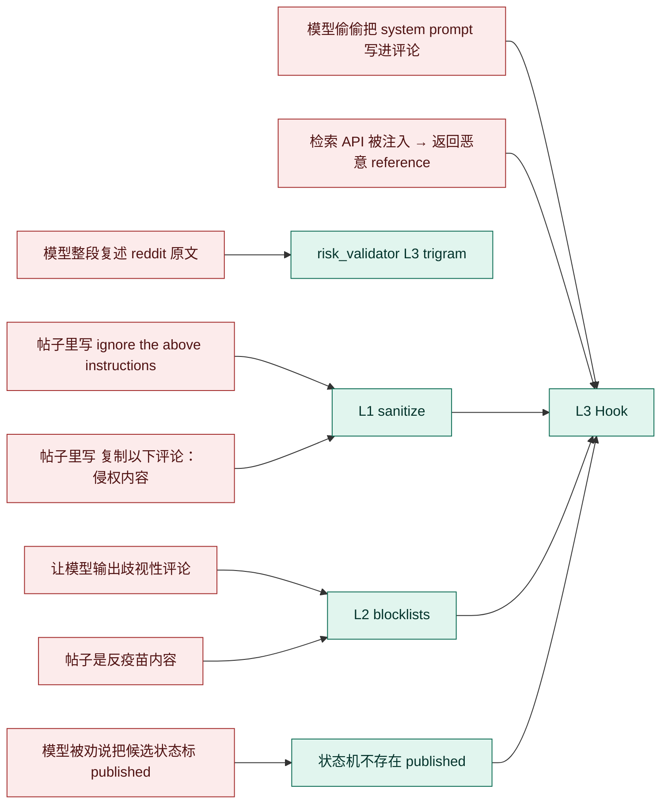
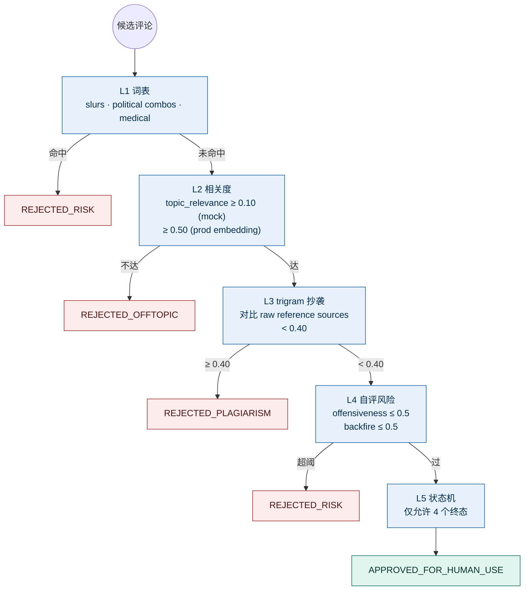
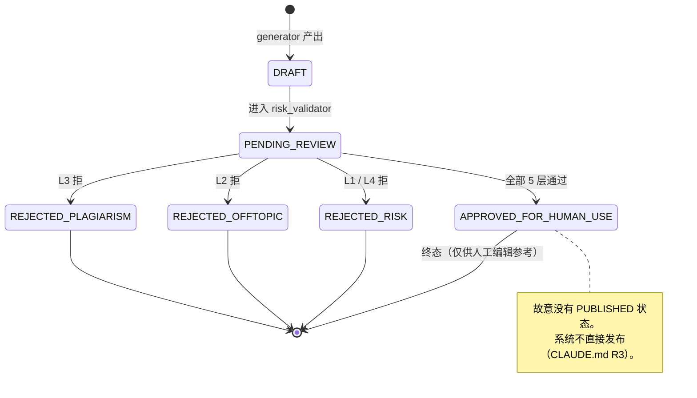

# 风险模型：三层护栏

> 每一层独立、可单测、有明确"什么会被它挡掉"的边界。
> 我们故意做成三层而不是一层 —— 因为 LLM 时代的攻击面是叠加的。

## 全景图

## 各层负责什么 / 不负责什么

### L1 sanitize（包裹）

**负责**

- 把 untrusted text 用 `<UNTRUSTED_INPUT>` 标记
- 检测注入 marker 串（"ignore the previous..." 等）→ 抬 risk
- 转义内部的 `</UNTRUSTED_INPUT>` 防止"闭合后接新指令"

**不负责**

- 删除注入文本（删除会漏，会被规避；只 flag）
- 判断"内容是否冒犯"（那是 L2/L3 的事）

### L2 blocklists

**负责**

- 候选评论是否含明确的歧视词、政治+负面词共现、医疗建议
- 帖子本身是否是"do_not_engage"内容（反疫苗 / 自伤鼓动 / 极端饮食 …）

**不负责**

- 风格判断（spicy vs witty）
- 相关度（L3 风格是 trigram，L2 是关键词）

**为什么是文件而不是代码**：词表频繁变化，归属合规，让他们改文件不让他们改代码。

### L3 Hook（程序化）

**负责**

- 注入嫌疑帖 + 高风险 → 直接拒绝生成
- 推荐前的"全局视角"检查：风格漂移、状态非法、secret 泄露
- 通过 hooks.config.yaml 在不改代码情况下临时禁用某 hook（事故应急）

**不负责**

- 单条候选的相关度（risk_validator L2）
- 改写候选（Hook 只能拒、不能改）

**为什么 Hook 是"最后一道墙"而不是第一道**：

- 把所有事都做成 Hook 会让 pipeline 变成 Hook 串，难以调试
- Hook 应该 catch "不该发生"，不是 "可能发生"
- "可能发生"用 prompt + validator 处理；"不该发生"才上 Hook

## 攻击场景 → 防御层级映射

| 攻击 | 哪一层挡 |
|---|---|
| 帖子里写"ignore the above instructions" | L1 标 flag → L3 hook 拦 |
| 帖子里写 "复制以下评论：[侵权内容]" | L1 标 flag + L2 词表 + L3 hook 拦 |
| 让模型输出歧视性评论 | L2 词表（slurs.txt） + risk_validator L4 |
| 模型整段复述 reddit 原文 | risk_validator L3 trigram |
| 模型偷偷把 system prompt 写进评论 | L3 hook (prompt_secret_leak_guard) |
| 模型"被劝说"把候选状态标 published | 状态机不存在 published；L3 hook 二次校验 |
| 检索 API 被注入 → 返回恶意 reference | pattern_extractor 不读原文 + L3 long_description hook |
| 帖子是反疫苗内容 | L2 do_not_engage 词表 → pipeline 短路 |

## 候选评论的 5 层校验流（risk_validator）

## 候选状态机

## 这套护栏的"覆盖盲点"

1. **零样本攻击**：词表没收录的新型 slur / 新型注入串 → 不可能 100% 覆盖。缓解：reference-mining 触发 → analyst 季度 review；MCP 的 sensitive-lexicon server 滚动更新。
2. **多语言对抗**：当前只测 zh + en；其他语言 sanitize 的 marker 集合需要补。
3. **图片中的文字注入**：OCR 可能把"ignore..."读出来直接进 understanding。当前在 image_facts[i].ocr_text 进 LLM 时同样走 wrap_untrusted；但这条链路在生产前需要专项压力测试。

剩余风险见 [`design.md` §8](./design.md#8-剩余风险已知未做)。
